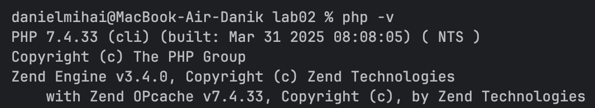
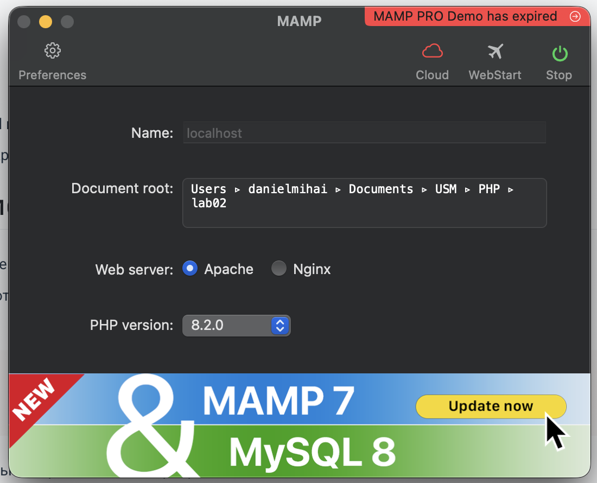
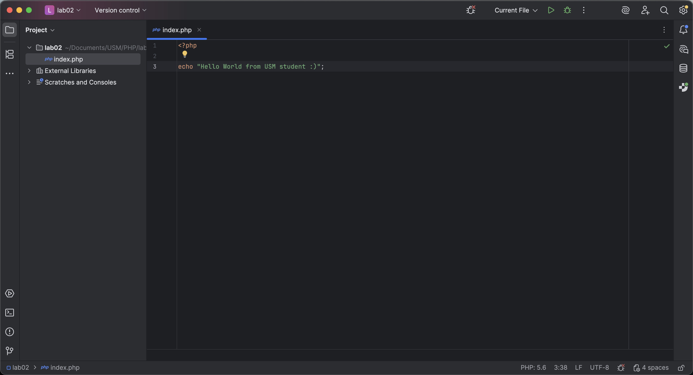
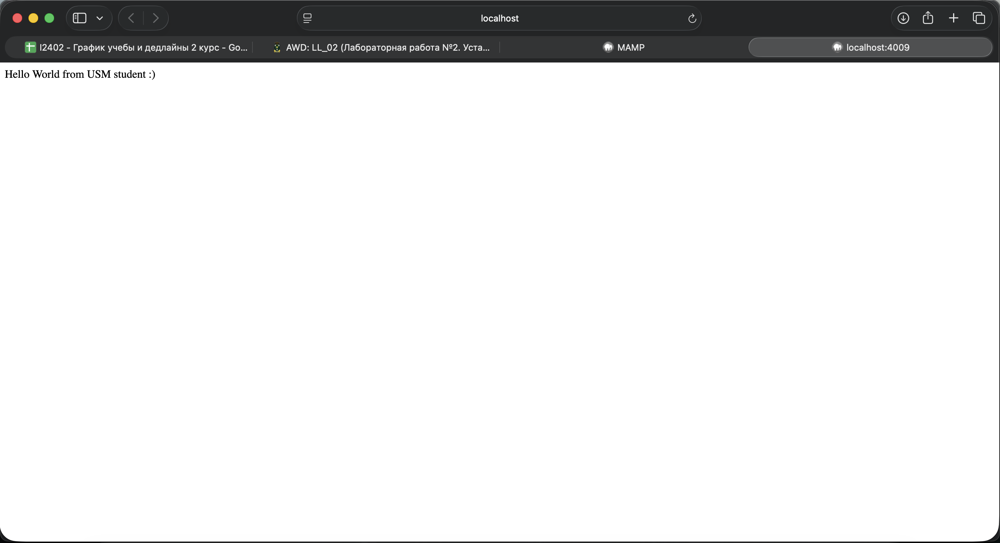
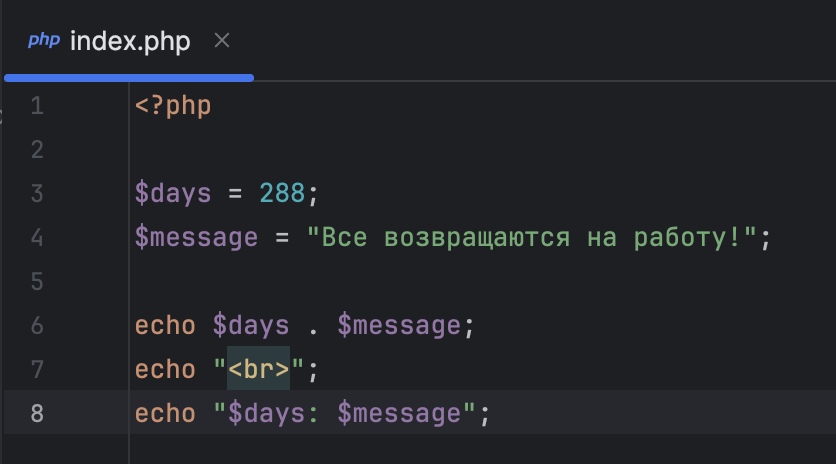
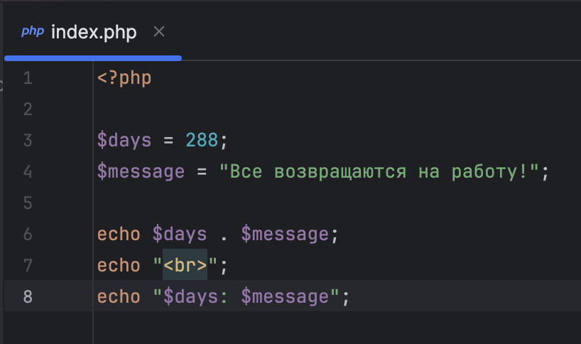
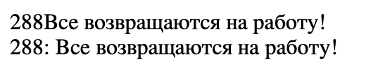

# Лабораторная работа №2 
# Установка и первая программа на PHP

## Студент: Mihai Daniel  
## Дисциплина: PHP  
## Тема: Установка и первая программа на PHP

# Цель работы

Целью данной лабораторной работы является установка и настройка среды разработки для работы с языком программирования PHP, а также создание первой программы на PHP.

# 1. Установка PHP

# 2. Установка MAMP

Установил MAMP и настроил запуск, установив путь до папки с лабороторной работой #2.

# 3. Написание первой PHP программы

Создал файл index.php и вывел на странице текст через echo.

# 4. Вывод текста через echo и print 

# 5. Работа с переменными

Создал переменные и попробовал их вывести разными способами.

# Контрольные вопросы

1. Какие способы установки PHP существуют?
  - Через пакетный менеджер ОС
  - Установка готовых сборок (XAMP, MAMP)
2. Как проверить, что PHP установлен и работает?
  - Ввести в консоли php -v
3. Чем отличается оператор echo от print?
  - echo:  быстрее, может выводить несколько строк, не возвращает значение
  - print: медленнее, выводит одну строку, возвращает 1

# Вывод

В ходе лабораторной работы была написана первая программа на PHP, изучены способы вывода данных и работа с переменными.
Полученные знания являются основой для дальнейшего изучения серверного программирования на PHP.

